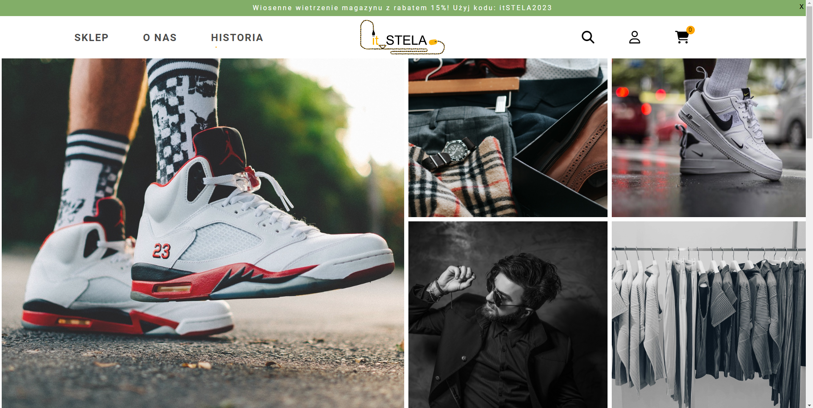

<table align="center">
    <tr>
        <td>
            
        </td>
    </tr>
</table>

# Website for my shop itSTELA

To visit page click https://manioo77.github.io/Sklep-it_STELA/ or clone locally and follow instructions given below.

_Strona internetowa dla sklepu itStela jest w ciągłym tworzeniu i ulepszaniu. Jest to strona tworzona z widoku frontendu. Technologie użyte to HTML5, CSS3 i JavaScript._

_The website for itStela is under constant development and improvement. This page is created from the frontend view. The technologies used are HTML5, CSS3 and JavaScript._

## Screenshot of the working page

## To run project

- Install local http server `npm install -g live-server` - [website](https://www.npmjs.com/package/live-server).

- Then run using `live-server`
